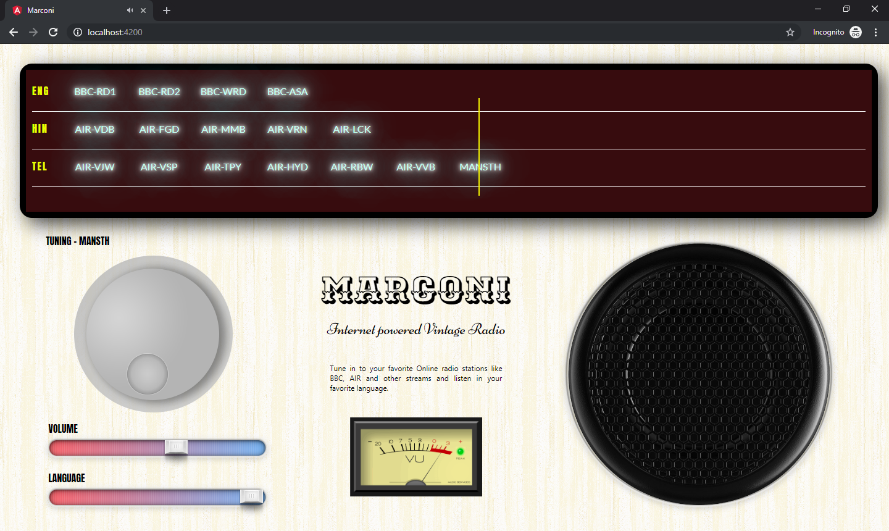
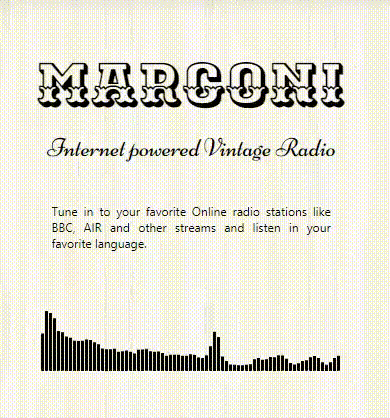

# Marconi

This web based application brings, vintage look to several online radio streams. The applicaiton is build with Angular. Below is the screenshot of the applicaiton with online radio stations from multiple sources available in the Internet.

  

## Introduction

The idea is to develop an applicaiton with similar look and feel of a vintage radio from 80s and 90s. Instead of using the radio waves to receive signals, the application uses the internet streams from [different](https://gist.github.com/stengland/8705765) [sources](http://prasarbharati.gov.in/liveradio.php) available in Internet. 

## Implementation

This applicaiton is implemented in Angular with Html-5. The key html element is `Audio` tag. By rotating the [dial](https://www.cssscript.com/demo/dial-knob-jogdial/), the circular motion is converted into horizontal distance and the needle on the scale is moved. After moving the needle (by updating the `left` property), the station element which is under the current position is obtained from DOM. With the `data-` attributes, we get the station's source URL and other properties if needed. This source URL will be applied to `Audio` tag, which will start the streaming, and produces the audio.

## Audio Analysis

This feature depends on the host of the audio stream, whether it allows CORS requests or not. If the request is allowed by other domains, then we can create a [`AudioContext`](https://developer.mozilla.org/en-US/docs/Web/API/AudioContext) and [`analyze`](https://developer.mozilla.org/en-US/docs/Web/API/AnalyserNode) the audio. The below image shows the analysis output, which is painted as an equalizer on the `canvas` tag.

   

To enable the above equalizer feature, we have to uncomment the code, which is related to gathering the frequencies from the audio analyser and add the `crossorigin` attribute in `audio` tag.

PS: <i>All the source streams used in this applicaiton are for the purpose of learning only and governed by their original terms and conditions.</i>